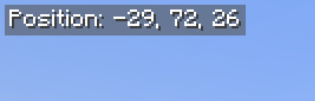

# Just Coordinates

A lightweight client-side mod that displays only XYZ coordinates, inspired by Bedrock Edition. No minimap, no extra info — supports Fabric, NeoForge, and Forge.



## Features

- Displays coordinates in the top-left corner with a gray background and white text, matching the Bedrock Edition style
- Format: `Position: X, Y, Z`
- Client-side only — no server installation required

## F3 Debug Screen

This mod does not replace the F3 debug screen. It only shows XYZ coordinates — no direction, biome, light level, or other debug information. The coordinates HUD is automatically hidden while the F3 screen is displayed.

## HUD Visibility (F1 Key)

When the HUD is hidden using F1, the coordinates will also be hidden. This follows vanilla HUD behavior.

## Supported Versions

| Minecraft | Fabric / Quilt | NeoForge | Forge |
|-----------|--------|----------|-------|
| 1.21.11   | Yes    | Yes      | Yes   |
| 1.21.10   | Yes    | Yes      | Yes   |
| 1.21.9    | Yes    | Yes      | Yes   |
| 1.21.8    | Yes    | Yes      | Yes   |
| 1.21.7    | Yes    | Yes      | Yes   |
| 1.21.6    | Yes    | Yes      | Yes   |
| 1.21.5    | Yes    | Yes      | Yes   |
| 1.21.4    | Yes    | Yes      | Yes   |
| 1.21.3    | Yes    | Yes      | Yes   |
| 1.21.1    | Yes    | Yes      | Yes   |
| 1.20.1    | Yes    | -        | Yes   |
| 1.19.2    | Yes    | -        | Yes   |

## Build

Build a specific platform for a target Minecraft version using `-Ptarget_mc_version`:

```
./gradlew :fabric:build -Ptarget_mc_version=1.21.11
./gradlew :neoforge:build -Ptarget_mc_version=1.21.11
./gradlew :forge:build -Ptarget_mc_version=1.21.11
```

The default `target_mc_version` is `1.21.1` (defined in `gradle.properties`), so the following also works:

```
./gradlew :fabric:build
```

Build outputs are located in `<platform>-<mc_version>/build/libs/` (e.g. `fabric-1.21.11/build/libs/`).

## License

LGPL-3.0-only
